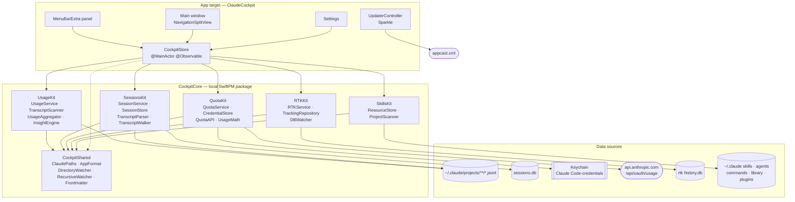

# ARCHITECTURE — Cockpit for Claude

Source of truth for how the app is put together. The French mirror is
[`ARCHITECTURE.md`](ARCHITECTURE.md); both are edited in the same pass. The design decisions
behind these choices live in
[`docs/superpowers/specs/2026-09-21-claude-cockpit-design.md`](docs/superpowers/specs/2026-09-21-claude-cockpit-design.md).

## Overview

Cockpit for Claude is a native macOS app (Swift 5.9, SwiftUI over an AppKit shell, macOS 14+) that
reads five independent sources and presents them in one place: Anthropic's quota gauges, Claude
Code's local transcripts — read live for local usage and indexed into a local database for the
Sessions section — rtk's savings database, and the skills / agents / commands tree.

The split that governs everything else is **logic in a package, UI in the app target**.
`CockpitCore` is a local SwiftPM package with no UI framework in sight: it builds and tests
without an `NSApplication`, which is what makes `swift test` fast and reliable. The app target
holds SwiftUI views, the AppKit shell, Sparkle, and a single hub object that owns the services.

Each kit exposes one **service** — an actor, or a `Sendable` class — that produces an immutable
**snapshot** struct. The app never opens a file, a socket or a database itself. That boundary is
the reason a failure in one source cannot take down another: the store catches it, stores it as
a state, and the corresponding section renders a banner while the rest keeps working.

## Component diagram

An interactive version of this diagram (pan, zoom, search, guided views, source references verified against the repository) is published at [https://smartcolibri.github.io/ClaudeCockpit/diagrams/claude-cockpit-architecture.html](https://smartcolibri.github.io/ClaudeCockpit/diagrams/claude-cockpit-architecture.html). Its source is `docs/diagrams/claude-cockpit.architecture.json`.

## Modules

| Module | Responsibility | Key types | Depends on |
|---|---|---|---|
| `CockpitShared` | Everything the other kits agree on: where files live, how numbers and dates are written in the app's language, how to watch a directory, how to parse front matter | `ClaudePaths`, `AppFormat`, `DirectoryWatcher`, `Frontmatter` | Foundation |
| `UsageKit` | Turns Claude Code's transcripts into every figure the usage screens show | `UsageService`, `TranscriptScanner`, `UsageAggregator`, `UsageSnapshot`, `UsagePeriod`, `UsageOverview`, `UsageEvent`, `PricingSettings`, `InsightEngine`, `SessionSummary`, `BreakdownDimension` | `CockpitShared` |
| `SessionsKit` | Indexes Claude Code's transcripts into a local SQLite/FTS5 database and answers every question the Sessions section asks of it: listing, paging a transcript, full-text search, activity, recent edits, health | `SessionService`, `SessionStore`, `TranscriptParser`, `TranscriptWalker`, `SessionHealthRule`, `SessionExporter`, `SessionRef`, `SessionMessage`, `ContentBlock`, `SessionFilter`, `ActivityReport` | `CockpitShared`, SQLite.swift |
| `QuotaKit` | Reads the OAuth token, calls Anthropic's gauge endpoint, enforces the rate-limit policy, projects the pace | `QuotaService`, `CredentialStore`, `QuotaAPI`, `Meter`, `GaugeSnapshot`, `PaceProjection`, `UsageMath`, `PaceSentence` | `CockpitShared` |
| `RTKKit` | Read-only access to rtk's SQLite database, plus a watcher that fires when rtk writes | `RTKService`, `TrackingRepository`, `DBWatcher`, `RTKSnapshot`, `CommandRecord`, `TotalsStat`, `DayStat`, `CommandStat` | `CockpitShared`, SQLite.swift |
| `SkillsKit` | The three-level resource tree, its inventory, and every mutation with its backup | `ResourceStore`, `ProjectScanner`, `ClaudeResource`, `PluginResource`, `SkillsInventory`, `ResourceKind`, `ResourceLevel`, `SkillsError` | `CockpitShared` |
| `OverviewKit` | Ranks the Overview's recommendations from plain values gathered across the sources | `RecommendationEngine`, `RecommendationInput`, `Recommendation` | — |
| App target | SwiftUI views, the AppKit shell, Sparkle, and the hub that owns the services | `CockpitStore`, `SettingsKey`, `AppDelegate`, `UpdaterController`, `CockpitSection`, `SourceState` | all of the above, Sparkle |

`ClaudePaths` deserves a note: every path in the app is computed from a `home` URL held by that
struct, and `CLAUDE_CONFIG_DIR` is applied in `ClaudePaths.live`. Pointing the whole app at a
temporary directory is therefore one initializer away, which is how the test suites run against
fixture trees without touching the real `~/.claude`.

## Data flow, per source

### Usage — local transcripts

Claude Code appends one JSONL transcript per session under
`~/.claude/projects/<encoded cwd>/<session>.jsonl`, plus one per sub-agent under
`…/subagents/agent-*.jsonl`. `TranscriptScanner` walks that tree and keeps, for each file, its
modification date and how many bytes it has already read, so a refresh only parses what was
appended since. Lines of type `assistant` carrying a `message.usage` object become `UsageEvent`s;
all lines sharing a `message.id` are merged into one event. Claude Code writes one line per
content block of a response, with usage growing across them, and the same response can appear in
both a session transcript and a sub-agent one, so each token field takes the **max** over the
copies (line order is not reliable) and the response is counted once. Session titles come from standalone `ai-title` lines and `slug` fields, collected
in the same pass.

`UsageService` owns the scanner and the resulting event list. Aggregation is deliberately
separate: `UsageAggregator.snapshot(events:filters:pricing:now:)` is a pure function, so changing
a filter or a price recomputes the screen without re-reading a single byte from disk.

**The Usage screen follows its filters, all of them.** Model, project and period apply to every
figure on it; today-versus-yesterday comparisons belong to the Overview. Besides the totals,
breakdowns (project, model id, agent, skill, each with its session count) and sessions,
`UsageSnapshot.period` (`UsagePeriod`) carries the series computed from the filtered events:

- `days`: each day of the period, normalised with `startOfDay` after every step (a day where
  summer time starts at midnight begins at 01:00), never past today; `.all` starts at the first
  filtered event.
- `buckets`, one bar each: hours for a one-day period, days up to 62, ISO weeks up to 30 weeks,
  then months; the first week or month is clipped to the period's start. Each bucket carries its
  cost per model family, its tokens per kind and its distinct sessions.
- `hourly` totals per hour of day, divided by the number of days for the mean cost per hour;
  `sessionsByWeekday` (Monday first, each session counted once on the day of its first turn, so
  the counts add up to the Sessions figure) and `weekdayDays`, how many of each weekday the
  period holds, so a weekday "this week" has not reached is left out rather than drawn at zero.
- `previousCostUSD`, the cost over `DateRangeFilter.previousBounds`, with the same model and
  project filters: yesterday up to the same time for Today, last week or last month up to the
  same point for This week and This month, the month before for Previous month, the N days
  before for N days (ending at now minus N days), nothing for All. Steps are calendar steps, so
  the wall-clock time survives a DST switch, and a month-to-date end is clamped to the shorter
  month.

**Cadence:** every 30 seconds by default, never faster than 10. The scan runs off the main
thread; the snapshot lands on the main actor.

### Quota — Anthropic's gauge

`CredentialStore` reads the OAuth access token from the keychain item `Claude Code-credentials`
through `/usr/bin/security`, which is the same tool Claude Code uses to write it, so no extra
authorization prompt appears. If that fails it falls back to `~/.claude/.credentials.json`. Both
shapes are accepted, wrapped in `claudeAiOauth` or bare, and an expired token is reported as
such rather than sent. The token is never persisted or logged by the app.

`QuotaAPI` issues one `GET https://api.anthropic.com/api/oauth/usage` and parses the meters into
a `GaugeSnapshot`: the five-hour session meter, the seven-day meter, one meter per model
family (`seven_day_<model>` keys only), and, in `other`, the undocumented buckets the endpoint
also reports (`nimbus_quill`, …) so the UI can show them without presenting them as models. `UsageMath.projection(for:now:)` turns a meter into a `PaceProjection` — where the
current rate lands at reset, the rate you are running at, the rate that would land exactly on
100, and the even daily share of what is left.

**Cadence and backoff.** The endpoint is rate-limited hard, so `QuotaService` is strict about it:

| Rule | Value | Applies to |
|---|---|---|
| Minimum spacing between reads | 3 min | Automatic refreshes |
| Backoff after a 429 | 15 min | Everything, including the refresh button |
| Floor on a forced refresh | 10 s | The refresh button, against double taps |
| Concurrent callers | Coalesced onto the single in-flight read | Everything |

A refused call returns the cached snapshot when there is one, and only throws
`QuotaError.throttled(until:)` when nothing has ever been read. A failure never clears
`lastSnapshot`: the panel keeps the last known figures with their timestamp.

### RTK — the savings database

`TrackingRepository` resolves the database at `~/Library/Application Support/rtk/history.db`,
then `~/.local/share/rtk/history.db`, unless the user set an explicit path. It validates the
schema before trusting it, and opens a fresh read-only connection per query rather than holding
one open against a database another process is writing. `RTKService.snapshot()` reads today's
totals, the seven-day series, the all-time totals, the top commands and the recent trace in a
single pass and returns one `RTKSnapshot`.

Savings rates are volume-weighted (`SUM(saved) / SUM(input)`), not an average of per-command
percentages, which would let a handful of tiny commands dominate the figure.

**Cadence:** `DBWatcher` combines a kernel-event watch on the directory holding the database
with a polling fallback, debounced, and emits an `AsyncStream<Void>`. The store refreshes on
every tick, plus a 60-second poll that covers the case where no database existed at launch.

### Skills — the resource tree

`ProjectScanner` walks the configured roots — `~/DevApps` and `~/Documents/GitHub` by default —
at most three levels deep, skipping hidden directories and build caches, and stops descending
once a directory is recognized as a project. A project is any directory owning a `.claude/`.

`ResourceStore.inventory(projects:)` then reads three levels: Library
(`~/.claude/skillmanager/library`), Global (`~/.claude`), and one level per discovered project.
Skills are directories holding a `SKILL.md`; agents and commands are single `.md` files. Front
matter gives each one its name and description. The plugin cache is read separately, read-only.

Mutations — `transfer`, `importPlugin`, `delete` — all follow the same rule: validate that both
ends are inside the user's home directory, copy the affected files into
`~/.claude/backups/<yyyyMMdd-HHmmss>/<level>/<kind>/…`, then act. The backup path comes back to
the caller, and the UI shows it in the confirmation. Names are sanitized before becoming file
names.

**Cadence:** a `DirectoryWatcher` over the six global and library directories, plus a manual
refresh. Mutations refresh the inventory themselves. A directory that does not exist yet is
polled for and attached when it appears, without ticking in the meantime; a watched directory
that is deleted or renamed is dropped and polled for again.

### Sessions — the indexed transcript archive

Sessions reads the same tree `UsageKit` reads — `~/.claude/projects/<encoded cwd>/<session>.jsonl`
plus `…/subagents/agent-*.jsonl` — but for a different purpose: not aggregate figures, a
browsable, searchable transcript archive. `TranscriptWalker` walks the tree incrementally,
resuming each file from the byte offset reached last time, exactly like `UsageKit`'s scanner.
`TranscriptParser` turns each appended line into a typed `ParsedLine`, and `SessionStore` upserts
the result into `sessions.db`, a SQLite database at
`~/Library/Application Support/ClaudeCockpit/sessions.db` with an FTS5 virtual table for search.

**The index stores references, not the archive.** Copying every message and tool body into the
database would multiply the corpus rather than index it, so the `blocks` table holds
`(file_id, byte_offset, byte_len)` and the display text is read back from the transcript on
demand — transcripts are append-only, so an offset stays valid forever. Only a short
`text_preview` per message is denormalised for the list. FTS5 is fed selectively: user and
assistant text, thinking, tool inputs, and the first few kilobytes of each tool output.
Attachment bodies are never stored, only counted into `attachmentCount`, because they carry
entire injected skills and are the single most frequent line type in the corpus.

Sub-agent transcripts carry their **parent's** `sessionId` in every line, so they are indexed as
sessions of their own, keyed by the sub-agent's `agentId`, with `parentSessionId` pointing back
at the session that spawned them. `SessionFilter.includeSubagents` keeps them out of the main
list by default. On Vincent's archive of 987 indexed sessions (986 transcript files, 912 MB
read), 96.5 % of sub-agent transcripts were linked back to the exact `Agent` tool call that
spawned them; the rest still index and list, just without that specific cross-reference.

`SessionHealthRule` grades a session A–F from counters the indexer already maintains — tool
error ratio, API errors, aborted or interrupted turns, repeated identical tool failures, a
session that ended on an error — so computing a grade never re-reads a transcript.
`SessionExporter` renders one session, sub-agent transcripts inlined, to Markdown or
self-contained HTML.

**Cadence and live follow.** Indexing runs on its own timer, staggered against `UsageKit`'s 30 s
scan so the two do not walk the same archive on the same tick; a full index of the archive above
takes about 20 s, an incremental pass with nothing new to read about 0.16 s, and the resulting
database is about 206 MB. `CockpitStore` also arms a `RecursiveWatcher` — the shared,
FSEvents-backed recursive watcher in `CockpitShared`, generalised from `RTKKit/DBWatcher.swift` —
on `~/.claude/projects`, because a non-recursive `DirectoryWatcher` does not see a line appended
to a file several directories down. A debounced file-system event triggers an incremental index
pass, and the Sessions store publishes the change so an open session auto-appends and the list
shows a "live" badge.

**Mutations are index-only.** Starring, renaming and hiding a session write to `sessions.db`
alone; the transcript on disk is never touched. Hiding sets `deleted_at` and the row drops out of
every listing until the next full rebuild, which is also the only way to recover from a
corrupted database — `index(full: true)` drops and rebuilds it, carrying stars, custom names and
hidden sessions forward since they live nowhere else. The same marks are carried across a
schema bump, when the database is rebuilt on first open. A pruned transcript only takes its
session with it when no remaining file carries that session id, so a renamed project folder
re-reads its sessions from the new path instead of dropping them, and a row holding a mark is
never deleted.

**Token counting.** Several `messages` rows can belong to one API response (one line per content
block, or the same response in a session and a sub-agent transcript). Aggregates count each
`api_message_id` once, taking the max of each usage field over its copies, and are recomputed
for every session sharing a response whenever one of them is ingested or purged.

### Overview — the landing dashboard

The Overview is a bento of tiles built from four sources at once, under
`Window/Sections/Overview/` with one view per tile. Every figure **ignores the Usage screen's
filters**: `UsageAggregator.overview(events:pricing:now:calendar:home:)` computes a
`UsageOverview` from all events, carried by every `UsageSnapshot`. It holds the last 30 days of
cost per day and model family, one cost per day over the 12-week activity window (Monday of the
week eleven weeks back to today), today and yesterday by hour, today's tokens by kind, the top 5
projects and the model mix over 30 days, the project spending most on Opus and Opus's share of the
30 days before, the cache read rate (cache reads over cache reads + writes + input — writes count,
unlike `InsightEngine`'s ratio, or every Claude Code account reads near 100 %), unpriced models
(`<synthetic>` and zero-token turns are not model usage), the mean daily cost of the full days
before today (30, or fewer since the first event), month-to-date cost with a linear projection (calendar days, none before a full day) and
last month's cost, and this week against the same stretch of last week.

- Tiles: today's cost (14-day sparkline, delta against the 30-day mean, month projection), tokens
  today (split bar), RTK over 7 days (savings weighted by `DayStat.inputTokens`), cost per day
  stacked by model, top projects, by hour today against yesterday, session health (mean
  `SessionRef.healthScore` today and over 7 days, sessions with errors, sessions below 60), active
  skills, and the activity heatmap: sessions per day from `SessionService.activity`, cost per day
  from `UsageOverview.dailyCost`, because the index only knows the cost Claude Code recorded.
  A sub-agent's turns credit its parent session in those daily counts (the Activity tab's too),
  so a day's figure matches what the browser lists for it; the sub-agents of a hidden session are
  hidden with it.
- Interactions: Swift Charts tooltips follow the pointer (`chartOverlay` + `onContinuousHover`,
  since the built-in selection waits for a click on macOS); each tile is one button leading to its
  section; a heatmap day opens the Sessions browser bounded to that day (`since`/`until`, shown as
  a date chip), the health tile and the errors recommendation open it on "With Errors" for today, a session row opens that transcript.
  `CockpitStore.showSessions(…)` starts from a fresh `SessionFilter` so nothing the user had
  narrowed hides the target.
- Each tile wraps its content in `TileSource`: the grant flow when unauthorized, the error with a
  retry, a loading line — a failing source only blanks its own tiles. Below 920 points the right
  column moves under the tiles; row heights are fixed so the whole bento fits the default window.
- **Recommendations** come from `OverviewKit.RecommendationEngine`, a pure function of a
  plain-value `RecommendationInput` (usage facts, today's session counts, rtk state — each `nil`
  or `.unknown` when its source is unavailable) to at most 5 `Recommendation`s ranked critical,
  warning, info, good, ties in rule order. Rules and thresholds (documented in code): week-to-date
  cost ±20 % (after a day, baseline ≥ $1), Opus ≥ 60 % of 30-day cost (≥ $5) *and* up 15 points on
  the 30 days before, naming the project, sessions with an error in a message dated today
  (`SessionService.sessionsWithErrors`, critical from 3), sessions scored below 60, one hour ≥ 40 %
  of today's cost (≥ $1 over ≥ 3 active hours), cache read rate < 30 % (≥ 1 M prompt tokens), rtk missing or saving < 30 % (≥ 20 commands), unpriced models, and a month projection
  ≥ 1.25 × last month (from day 3, last month ≥ $5). The core returns kinds and a target section;
  the app writes the sentence. Rules flag changes and anomalies only: a permanent state of the
  account (a long Opus habit, a good cache) would show every day and stop being read.
- The overview is cached by `UsageService` until a refresh, a pricing change or a new day, so the
  Usage screen's filters never recompute it.

## Concurrency model

The rule is one-directional: **services do the work off the main actor, the store publishes the
result on it.**

| Type | Isolation | Why |
|---|---|---|
| `CockpitStore` | `@MainActor @Observable` | Everything SwiftUI observes lives here and nowhere else |
| `UsageService`, `TranscriptScanner` | `actor` | Serializes scans and protects the incremental cache |
| `SessionService` | `actor` | Serializes indexing passes and every read/write against `sessions.db`, exactly like `UsageService` serializes scans |
| `QuotaService` | `actor` | Serializes network reads and owns the rate-limit state |
| `ResourceStore` | `actor` | Serializes filesystem mutations so two transfers cannot interleave |
| `TrackingRepository` | `Sendable` struct | Holds no state beyond the database URL; each query opens its own connection |
| `RTKService` | `@unchecked Sendable` final class | Owns the watcher; the store calls its snapshot from a detached task |
| `DirectoryWatcher`, `DBWatcher` | `@unchecked Sendable` | DispatchSource-backed, publish through `AsyncStream<Void>` |
| `RecursiveWatcher` | `@unchecked Sendable` | FSEvents-backed, recursive; `CockpitStore` arms it on `~/.claude/projects` for the Sessions live follow |
| Snapshots (`UsageSnapshot`, `GaugeSnapshot`, `RTKSnapshot`, `SkillsInventory`, `SessionRef`, `ActivityReport`) | immutable `Sendable` | Cross the actor boundary without copying concerns |

`CockpitStore.start()` launches the refresh loops once and keeps their `Task` handles. There are
six: usage on its interval, sessions on its own staggered interval plus the `RecursiveWatcher`
stream for live follow, quota on a three-minute interval, rtk on the watcher stream, a slower rtk
fallback poll, and skills on the directory watcher. They are structured as
`while !Task.isCancelled { await refresh…(); try? await Task.sleep(…) }` rather than as
`Timer`s, which sidesteps the run-loop-mode trap that bites menu-bar apps (see Gotchas).

The heavy synchronous work — scanning the project tree, reading the SQLite snapshot — is pushed
onto `Task.detached(priority: .utility)` so it never occupies the main actor.

## Persistence

Nothing about the user's data is cached beyond the scan index. What persists is preferences and
the incremental scan state.

### UserDefaults

| Key | Type | Default | Meaning |
|---|---|---|---|
| `settings.launchAtLogin` | Bool | off | Mirrors the `SMAppService` registration |
| `settings.menuBarOnly` | Bool | off | Activation policy: `.accessory` when on, `.regular` when off |
| `settings.menuBarMeter` | String | `week` | Which quota the menu bar shows: `week`, `session` or `both` |
| `settings.usageRefreshSeconds` | Int | 30 | Usage loop interval, floored at 10 |
| `settings.rtkDBPath` | String | empty | Explicit rtk database path; empty means auto-resolve |
| `settings.projectRoots` | String | empty | Newline-separated roots; empty means the defaults |
| `settings.pricingJSON` | String | — | The four model-family rates, serialized |
| `settings.currency` | String | `USD` | Display currency |
| `settings.eurRate` | Double | 0.92 | USD to EUR conversion used when the currency is EUR |
| `settings.sessionsIndexEnabled` | Bool | on | Whether transcripts are indexed for the Sessions section |
| `sessions.showSystemLines` | Bool | off | "Afficher les lignes système" toggle in the transcript view |
| `sessions.grouping` | String | `day` | Session list grouping: `day` or `project` |
| `sessions.selectedId` | String | — | Last opened session |
| `sessions.tab` | String | `browser` | Last selected Sessions tab: browser, activity or edits |
| `panel.section.limits` | Bool | true | Panel section collapse state |
| `panel.section.today` | Bool | true | Panel section collapse state |
| `panel.section.savings` | Bool | true | Panel section collapse state |
| `window.section` | String | — | Last selected sidebar item |

Defaults are registered in `SettingsKey.registerDefaults()`, called from the store's
initializer, so a fresh install and an upgraded one read the same values.

### Files the app writes

| Path | Content | Lifetime |
|---|---|---|
| `~/Library/Application Support/ClaudeCockpit/scan-cache.json` | Per-file `(mtime, bytesRead)` plus collected session metadata | Rewritten only when a scan actually read new bytes; cleared by a full rescan |
| `~/Library/Application Support/ClaudeCockpit/sessions.db` (+ `-wal`/`-shm`) | The Sessions index: `sessions`, `messages`, `blocks` (byte offsets, not bodies), `edits`, `subagents`, `pr_links`, and an FTS5 table. About 206 MB for Vincent's 912 MB archive | Updated incrementally by byte offset on every index pass; "Reconstruire l'index" drops and rebuilds it, stars, names and hidden flags carried over |
| `~/.claude/backups/<yyyyMMdd-HHmmss>/<level>/<kind>/…` | A copy of everything a mutation is about to touch | Kept 30 days: `BackupPruner` removes roots older than that at launch; unrecognised entries are left alone |

The app writes nowhere else. Transcripts, credentials and rtk's database are read-only, always.

Under the App Sandbox, "Application Support" above is the container's:
`~/Library/Containers/fr.smartcolibri.cockpitforclaude/Data/Library/Application Support/ClaudeCockpit`.
Nothing is migrated from a previous non-sandboxed install; the index is rebuilt.

### Sandbox access

The app ships sandboxed (`app-sandbox`, `files.user-selected.read-write`, `files.bookmarks.app-scope`,
no network entitlement). Inside the sandbox `homeDirectoryForCurrentUser`, `NSHomeDirectory()` and
`expandingTildeInPath` all answer the container, so:

- `ClaudePaths.live` takes the real home from `getpwuid(getuid())` and expands `~` with
  `ClaudePaths.expandTilde`; app data (`appSupportDir`) comes from
  `FileManager.urls(for: .applicationSupportDirectory)`, i.e. the container. `init(home:configDir:appSupport:)`
  with an explicit home still derives everything from it (tests).
- The Claude config directory is the "Dossier de configuration Claude" setting, then `CLAUDE_CONFIG_DIR`,
  then `~/.claude` (a Finder-launched app never sees the shell environment).
- `AccessStore` (app target) keeps the user's grants as app-scope security-scoped bookmarks in
  UserDefaults (`access.bookmarks`), resolves them at launch, recreates stale ones, and keeps each scope
  open for the process lifetime (watchers are long-lived). A bookmark that no longer resolves stays listed
  as broken in Réglages › Accès; one whose scope macOS refuses to open is listed as denied and covers nothing.
  "Réautoriser" swaps a grant in one step and refuses a folder that would lose the Claude config directory.
- `AccessCoverage` (CockpitShared, pure) decides whether a path is covered (whole-component prefix,
  no symlink resolution) and judges a folder picked in the grant panel (`full` / `partial` /
  `requiredElsewhere` / `unrelated`; the Claude config directory is checked first, so a home grant never
  reads as full when that directory lives on another volume). Outside the sandbox everything counts as
  covered, so unsigned Debug builds behave as before. Coverage is lexical: a config directory that is a
  symlink pointing outside the grant shows as covered, and its sources then fail to read (`failed`, not
  `unauthorized`).
- `CockpitStore` checks coverage before reading or watching anything: an uncovered source is
  `SourceState.unauthorized`, which the views render as "Accès non autorisé" with the grant button.
  The overview becomes the onboarding while `claudeDir` is uncovered. Any grant change calls
  `accessDidChange()`, which rebuilds the services if the config directory moved and restarts usage,
  sessions, skills and RTK, keeping the current snapshots on screen unless the archive changed. It bumps
  `accessGeneration`: a refresh that started earlier drops its result instead of overwriting the new state.
  The single `SessionService` follows a moved directory through `setPaths` (serialised on its actor, one
  connection to `sessions.db`, `busy_timeout` 5 s), and `TranscriptScanner` ignores cached entries outside
  the current `projectsDir`. Backups are pruned once per launch, as soon as `claudeDir` is covered.
- The recommended grant is the home folder: symlinks leaving a granted tree are denied
  (`~/.claude/skills/x -> ~/.agents/skills/x`), and RTK and project roots live elsewhere in the home.
  The RTK picker bookmarks the database's folder, since SQLite's WAL needs the `-wal`/`-shm` siblings, and
  stores nothing when the folder is refused (a file-only grant would show stale data); the
  read-a-copy fallback writes to `FileManager.temporaryDirectory`, the container's `tmp`.

### Demo mode

Interactive diagram: [https://smartcolibri.github.io/ClaudeCockpit/diagrams/claude-cockpit-demo-mode.html](https://smartcolibri.github.io/ClaudeCockpit/diagrams/claude-cockpit-demo-mode.html) (source `docs/diagrams/claude-cockpit-demo-mode.architecture.json`).

For App Review, which has no Claude Code data. `Scripts/make-demo-data.swift` writes a deterministic,
fictional tree to `ClaudeCockpit/Resources/Demo/` (bundled as a folder reference): `manifest.json` (time
anchor, original home `/Users/demo`) and `home/` with 3 projects, 8 detailed sessions (2 with subagents) plus about 140 short ones
spread over the 12 weeks before the anchor (busier on weekdays, written against the anchor's
weekday, so the busy days shift once seeded), skills,
agents and commands at every level plus a plugin, and an RTK `history.db`. Hidden folders are stored as
`_dot_x` so Xcode and git keep them.

- "Explorer avec des données d'exemple" (onboarding) or `CLAUDECOCKPIT_DEMO=1` calls `enterDemo()`.
  `DemoSeeder` (CockpitShared) copies the tree to `<container>/Application Support/ClaudeCockpit/demo/home`,
  restores the dot folders, shifts every JSONL timestamp per session (subagents move with their parent;
  anchor-day sessions are fitted inside `[start of today, now]`, older days keep their offset, clamped
  before the next day for DST) and the RTK `timestamp` column by UTC day, and rewrites `/Users/demo` to the
  demo home in JSONL paths and RTK `project_path`.
- `ClaudePaths.demo(root:)` makes the demo home *the* home (SkillsKit refuses paths outside `home`), with a
  separate `demo/appdata`. `CockpitStore.makePaths(demo:)` is the only place paths are built; the
  `SessionService` is rebuilt whenever the app-data folder changes, so the demo never indexes into the real
  `sessions.db`. `UsagePath.displayHome` follows the current home so paths read `~/…`.
- `isDemo` lives in memory only. Coverage is true inside the demo home; the RTK override is ignored.
  Transfer, import, delete, backup pruning, grants, launch at login, config dir, RTK path and project roots
  are refused in the store and disabled in the UI; `cache.projects` and `sessions.selectedId` are not
  written; resume shows a notice instead of copying a command. Stars, renames and hides only touch the demo
  index.
- "Quitter la démo" returns to onboarding; once the retired session and usage services have finished, the
  demo folder is deleted unless the demo was re-entered meanwhile. A normal launch deletes any leftover demo.

### Localisation

English is the development language (`developmentLanguage: en`, `CFBundleDevelopmentRegion` = `en`);
French ships as a translation and any other language falls back to English.

- **App strings** live in `ClaudeCockpit/Resources/Localizable.xcstrings`. SwiftUI literals
  (`Text`, `Button`, `Label`, `.help`) are keys; plain `String` values (notices, errors, computed
  labels, component parameters) go through `String(localized:)`. Paths, numbers and names use
  `Text(verbatim:)` so they never become keys. Counts use plural variations, one number per
  string: French treats 0 and 1 as singular, English only 1.
- **Core strings** live in one catalog per module (`defaultLocalization: "en"` in `Package.swift`)
  and use `String(localized:bundle: .module)` — errors and labels of SkillsKit, RTKKit, UsageKit,
  CockpitShared and SessionsKit. Where the core only needs to say *what* happened, it returns a
  value and the app words it: `DateRangeFilter`. `HealthEvidence` is a value
  too, worded by SessionsKit itself (`sentence(locale:)`) so its sentences are tested per
  language. QuotaKit is not linked into the app and stays French.
- **`AppFormat`** (CockpitShared) formats numbers, money, percentages, dates, durations and
  relative times in `AppFormat.locale`: the formatting locale of the language the app resolved
  (`Bundle.main.preferredLocalizations`), whatever the Mac's region — English is `en_US`
  ("$0.36", "Oct 10", "1,234"), French `fr_FR` ("0,36 $US", "10 oct.", "1 234"). Every function
  takes an explicit locale, which tests pin; formatters for the app's own locale are built once
  per style and reused. `relative(_:standalone:)` drops the "on"/"le" before an older date for
  columns and after a separator. Its few
  words ("just now", "2 h 05") switch on the locale's language rather than on a catalog, because
  a catalog follows the process language and could not be pinned.
- **`SessionExporter`** writes in the app's language: it looks its words up in the module's
  `<language>.lproj` for the locale (`Bundle.localization(for:)`) and sets `<html lang>`.
- `ContentBlock.truncationMarker` is stored and matched in `sessions.db`, so it stays as it is;
  the transcript views and the export swap it for the localised word
  (`ContentBlock.displayable(_:truncated:)`). FTS `snippet()` marks matches with
  private-use characters, which the list replaces with the locale's quotes.
- Counts in plural strings are formatted by the locale passed to `String(localized:…, locale:)`
  (`AppFormat.locale` in the app), so "1,234 turns" / "1 234 tours" keep their grouping.
- The export spells durations out ("2 h 10 min" / "2h 10 min"), unlike the compact in-app form.
- The scene roots and the snapshot panel set `.environment(\.locale, AppFormat.locale)` so
  charts and `LocalizedStringKey` interpolations follow the same locale.
- `Scripts/check-l10n.py`, run after a Debug build, compares each catalog with the keys the
  compiler extracted (`*.stringsdata`): nothing missing, nothing stale, every French value
  translated, plurals complete, format specifiers matching. It reads the DerivedData whose
  `info.plist` names this checkout's project (or the folder passed as argument), Debug only,
  skips `.stringsdata` of deleted files, and fails when a Swift file or a catalog is newer than
  the build.

## Error handling

The policy is one sentence: **every source fails alone, and a failure never destroys what was
already known.**

`SourceState` is `idle`, `loading`, `ready(Date)` or `failed(String)`, one per source. The store
sets `loading` only when there is no snapshot yet, so a refresh that fails behind a populated
screen leaves the figures in place and adds a banner rather than blanking the section.

| Situation | What the user sees |
|---|---|
| No OAuth token | The quota section explains how to sign in with Claude Code |
| Expired token | Named as expired, not as a generic network failure |
| Network error on the gauge | The last snapshot stays, labelled with the time it was fetched |
| 429 from Anthropic | Same, plus the moment the next read is allowed |
| Throttled refresh with a cached snapshot | Nothing: the cached snapshot is returned, not an error |
| No rtk database | The RTK section shows an install hint |
| Unexpected rtk schema | The section reports it instead of returning wrong numbers |
| Transfer destination exists | `SkillsError.alreadyExists` with the path, and a chance to overwrite |
| Path outside `$HOME` | `SkillsError.outsideHome`, refused before anything is touched |

Skills mutations are all-or-nothing per operation, and the backup path is surfaced in the
confirmation toast so an unwanted move is one Finder trip from being undone.

## Testing

Tests live in `CockpitCore/Tests/<Kit>Tests/` and run with `swift test`. There are no UI tests
and no `NSApplication` anywhere in the suite, which is what keeps the whole run cheap enough to
be worth doing on every change.

| Suite | Covers |
|---|---|
| `CockpitSharedTests` | Path derivation including `CLAUDE_CONFIG_DIR`, French formatting, front-matter parsing |
| `UsageKitTests` | Transcript scanning against JSONL fixtures, incremental re-reads, deduplication, pricing math, date-range bounds, aggregation, the Overview series on a Paris clock across a DST switch |
| `OverviewKitTests` | Every recommendation rule on both sides of its thresholds, ranking by severity then rule order, the cap of five, determinism |
| `SessionsKitTests` | Transcript line parsing for every line kind, incremental indexing and resume, deduplication, store queries (list filters, FTS snippets, recent edits, activity buckets), health grading, exporters, and a benchmark against the full real corpus |
| `QuotaKitTests` | Credential parsing for both JSON shapes and expiry, gauge parsing, pace math, and the rate-limit policy driven by an injected clock |
| `RTKKitTests` | Repository queries against a fixture `history.db` built in a temp directory, schema validation, watcher ticks |
| `SkillsKitTests` | Inventory over a temp `HOME` (symlinked resources included), transfer and import, backup creation, refusal of paths outside home, of symlinked resources and of a destination that resolves to the source |

The testability comes from two deliberate choices made in the design: every path flows from an
injectable `ClaudePaths`, and every dependency that touches the outside world sits behind a
protocol (`TokenProviding`, `QuotaFetching`) or takes an injected clock.

## Release pipeline

`Scripts/release.sh <version>` runs the whole thing:

1. `xcodegen generate`, then `xcodebuild -configuration Release` with `CODE_SIGNING_ALLOWED=NO`.
   The build number is the git commit count.
2. Stage through `ditto --norsrc --noextattr --noacl` into a clean temp directory.
3. Codesign with Hardened Runtime and a secure timestamp, deepest first: Sparkle's `Autoupdate`,
   `Downloader.xpc`, `Installer.xpc`, `Updater.app`, then the framework, then the app. Each
   signature is retried up to five times, because Apple's timestamp server is flaky.
4. Build the DMG with `dmgbuild` (settings in `Scripts/dmg-settings.py`, wheels pinned by hash in
   `Scripts/dmgbuild-requirements.txt`): icon-view layout, background image and `/Applications`
   alias, written as a `.DS_Store` without scripting Finder, into `release/`. The script then
   mounts the DMG and fails if the layout or the app's signature is missing.
5. Notarize with the shared keychain profile `AppliMacVincentGithub`, then staple and validate.
6. EdDSA-sign the DMG with `sign_update --account ClaudeCockpit` and write `appcast.xml`.
7. Print the `gh release create` command.

The feed is served from
`https://raw.githubusercontent.com/smartcolibri/ClaudeCockpit/main/appcast.xml`, declared as
`SUFeedURL` in `project.yml` alongside `SUPublicEDKey`. Publish the GitHub release before
pushing the feed: the enclosure URL points at the release asset, and a feed that goes live first
hands every client a 404.

## Gotchas

These are the ones that cost real time, in this project or in its ancestors. They are written
down because none of them announce themselves.

**Never regenerate the Sparkle key.** The private half lives in the login keychain under the
account `ClaudeCockpit`, backed up at
`~/Documents/SparkleKeys/ClaudeCockpit-sparkle-private-key.txt`. Its public half is baked into
every shipped copy as `SUPublicEDKey`. Running `generate_keys` again for that account, or
editing that value, makes every installed copy reject every future update, permanently. There
is no recovery short of asking users to reinstall by hand.

**`sparkle:version` is `CFBundleVersion`, not the marketing version.** Sparkle compares that
element against the running app's `CFBundleVersion`, which is an integer here. Writing `1.0.0`
into it makes the comparator read `1.0.0` against `1`, conclude the user is up to date, and
never offer the update. The marketing version belongs in `sparkle:shortVersionString` only.

**Codesign after `ditto --noextattr`, never in place.** A Release build carries
`com.apple.provenance` extended attributes that make `codesign --force` fail on recent macOS.
Hence `CODE_SIGNING_ALLOWED=NO` at build time and a manual signing pass over a staged copy.

**A `MenuBarExtra(.window)` panel has no natural height.** A `ScrollView` inside it collapses to
nothing unless the content is given an explicit frame, because the panel sizes itself to its
content and the scroll view is happy to be zero tall. Pin a height, or a range, on the panel's
root.

**Timers in a menu-bar app need `.common` run-loop mode.** A `Timer` scheduled in the default
mode stops firing while a menu or a popover is open — exactly when the panel is on screen. This
is why the refresh loops are `Task` loops with `Task.sleep` rather than timers.

**Sparkle dialogs need a Dock icon.** In menu-bar-only mode the app runs as `.accessory`, and
Sparkle's windows open behind everything with no way to bring them forward.
`UpdaterController` raises the activation policy to `.regular` for the duration of an update
session and lowers it back afterwards, but only when it was the one that raised it.

**One SQLite connection per query, read-only.** rtk writes to `history.db` while the app reads
it. Holding a long-lived connection invites lock contention and stale WAL reads; opening per
query costs microseconds and avoids both.

**Identifiable ids in Swift Charts must be stable.** An `id` computed as `UUID()` randomizes on
every access, so Charts sees an entirely new dataset on each redraw and rebuilds every mark.
Derive the id from the data instead.
